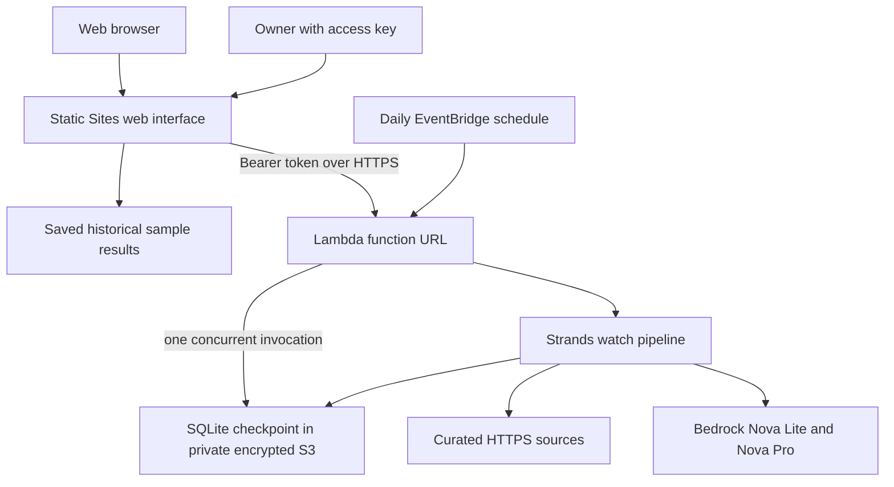

# BuiltWatch architecture

> For a competition-ready summary of the current user journey, deployed topology,
> agent boundary, cost controls, and browser audit evidence, see
> [COMPETITION_ARCHITECTURE.md](COMPETITION_ARCHITECTURE.md).

## Deployed web product

The public frontend contains example profiles and saved replay assessments only. It
cannot invoke a model without the owner key. The key is entered through the UI and kept
in session storage, never in URLs or committed source. There are no cookies or anonymous
write endpoints. The runtime verifies the key before accessing private data.

The private workspace supports profile CRUD/import, findings, dispositions, Markdown
handoffs, source coverage, history, and manual check requests. A scheduled check runs at
7 a.m. Toronto time. Manual checks have a persisted 30-minute cooldown.

## Persistence and scale

Every invocation downloads the latest database from private S3 and uploads the closed
SQLite checkpoint before returning. Reserved Lambda concurrency **must remain 1** to
serialize readers/writers. S3 versioning retains previous checkpoints for seven days.
This is a deliberately small, single-owner architecture. During long scans the API may
be throttled; the frontend explains that the workspace is busy. A multi-user service
should move to transactional storage and a separate worker queue before scaling out.

## Assessment correctness

Each completed pair is cached by system ID, a hash of the meaningful profile fields,
source ID, mode, and content hash. A new or edited system is evaluated against unchanged
sources. Failed pairs are not cached and resume on the next check.

Comparisons include the previous and current page text difference. First observations
are explicitly labeled as a baseline, not a new change. The agent is instructed to
ignore cosmetic differences; this is reasoning guidance, not a guarantee of precision.

Strands assessment tools only read stored evidence. Citations and profile fact references
are checked by code; unsupported relevance is downgraded. This establishes textual
support, not legal applicability or semantic correctness. Facts, inferences, unknowns,
and adoption status remain separate in the UI and handoff.

Findings deduplicate by development and material revision. Acknowledgement applies to
the recorded revision; a later material revision may become an open item again.

## Runtime limits

Model IDs: `us.amazon.nova-lite-v1:0` and `us.amazon.nova-pro-v1:0`.
See COST_CONTROLS.md. The CLI remains a local alternative. Deployment is reproducible via
`AWS_PROFILE=[aws-profile-redacted] .venv/bin/python infra/deploy_web.py --build-only`
then the same command without `--build-only`. Rebuild the package after backend edits.
