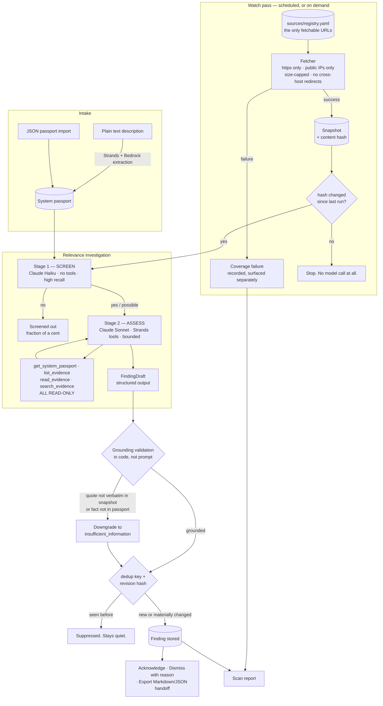
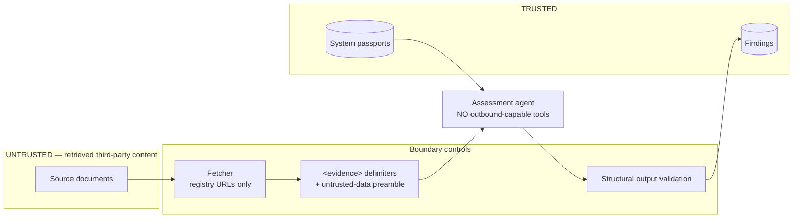
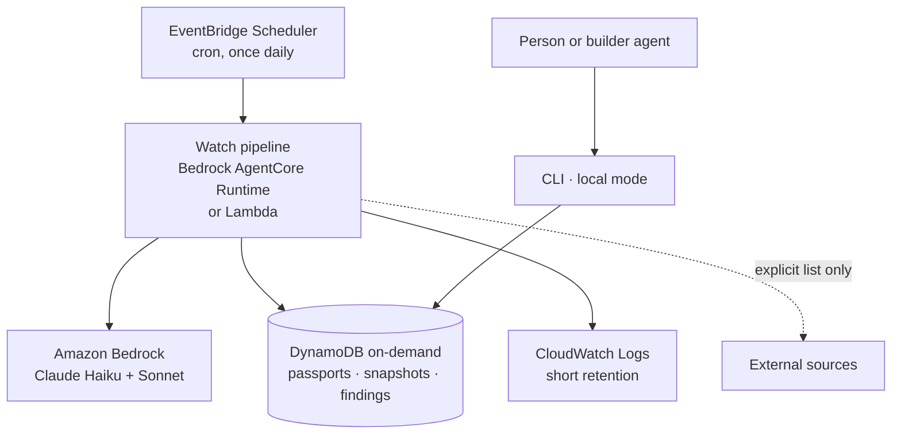

# BuiltWatch architecture

## The shape of the problem

Watching is a scheduling problem wearing a reasoning problem's clothes. The reasoning part
— "does this development affect this system?" — is genuinely hard and genuinely expensive.
The scheduling part runs every night forever. So the architecture's central job is to make
sure the expensive part almost never runs.

Everything below follows from that.

## Pipeline

## Why two model stages

A naive design sends every (system × changed source) pair to a strong model. With 12
systems and 11 sources that is 132 expensive investigations per night, most of them
answering "no, a Stripe API deprecation does not affect your static recipe site."

Instead:

| Stage | Model | Tools | Job | Rough cost per pair |
|---|---|---|---|---|
| 0 — hash check | none | — | Did the source change at all? | $0 |
| 1 — screen | Claude Haiku 4.5 | none | Could this plausibly matter? High recall. | ~$0.002 |
| 2 — assess | Claude Sonnet 4.5 | 4 read-only tools | Does it actually? With evidence. | ~$0.03 |

Stage 0 eliminates most nights entirely — sources usually do not change. Stage 1
eliminates most pairs on the nights they do. Stage 2 runs on a handful.

## Trust boundaries

Three independent layers, because any one of them can fail:

1. **Capability.** The agent has no tool that fetches a URL, sends a message, writes a
   passport, or executes code. A successful injection has nothing to reach for.
2. **Framing.** Retrieved text arrives inside `<evidence>` delimiters with an explicit
   untrusted-data preamble, so instruction-shaped text is legible as content.
3. **Verification.** Output is validated against stored data in code. A quote that is not
   verbatim in the snapshot, or a fact key absent from the passport, is rejected regardless
   of how confident the model sounded.

Layer 3 is the one that matters most, because it does not depend on the model behaving.

## Storage

| Table | Holds | Why it survives |
|---|---|---|
| `systems` | Passports, with provenance and unknowns | The inventory is the product |
| `snapshots` | Every retrieval ever made, with hash + status | Evidence must be re-readable to be citable |
| `scan_runs` | Every run including failed and aborted ones | A failed scan must be visible as a failed scan |
| `findings` | Keyed by `(dedup_key, revision_hash)`, superseded flag | Quiet on repeat, full history retained |
| `dispositions` | Acknowledge / dismiss / export, with reason and actor | A decision, once made, holds |
| `cost_ledger` | Per-run token spend by day and month | The ceiling needs something to count |

SQLite locally. The `Store` interface is deliberately narrow so the deployed path can swap
in DynamoDB without touching the pipeline.

## Deployment

Idle cost is zero by construction: the scheduler is free at this rate, DynamoDB on-demand
charges only for requests, and between invocations no compute exists. See
[COST_CONTROLS.md](COST_CONTROLS.md).

**Local mode is a first-class path, not a fallback.** `builtwatch scan --mode replay` runs
the entire product with no AWS deployment. Import and export are neutral HTTP/JSON, so
nothing here locks an inventory into this tool.

## Module map

| Module | Responsibility |
|---|---|
| [`models.py`](../src/builtwatch/models.py) | Domain types. `validate_grounding` lives here — the rules are types, not conventions. |
| [`config.py`](../src/builtwatch/config.py) | Settings, pricing table, `CostMeter`, the ceilings |
| [`store.py`](../src/builtwatch/store.py) | SQLite persistence, dedup, disposition, cost ledger |
| [`registry.py`](../src/builtwatch/registry.py) | Loads and states source coverage |
| [`fetch.py`](../src/builtwatch/fetch.py) | Live and replay retrieval, SSRF and size defences |
| [`agent/prompts.py`](../src/builtwatch/agent/prompts.py) | System prompts for both stages |
| [`agent/tools.py`](../src/builtwatch/agent/tools.py) | The four read-only Strands tools |
| [`agent/guard.py`](../src/builtwatch/agent/guard.py) | `BudgetGuard` — Strands hooks enforcing spend and iteration caps |
| [`agent/relevance.py`](../src/builtwatch/agent/relevance.py) | Screen, assess, and the grounding conversion |
| [`pipeline.py`](../src/builtwatch/pipeline.py) | One watch pass end to end |
| [`intake.py`](../src/builtwatch/intake.py) | Text extraction and JSON passport import |
| [`export.py`](../src/builtwatch/export.py) | Markdown and JSON builder handoff |
| [`cli.py`](../src/builtwatch/cli.py) | The local runnable mode |
