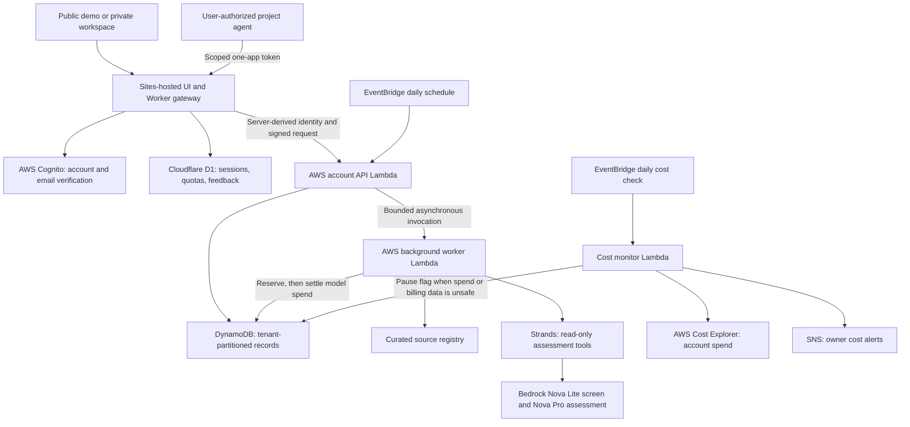

# BuiltWatch architecture

Updated 12 September 2026 against the current source. Infrastructure settings must
still be checked against the deployed AWS account before claiming a production audit.

## Purpose

BuiltWatch automates repeated impact assessment for people operating AI agents,
automations, APIs and small apps. It monitors a curated external-source registry
against lightweight saved profiles. It recommends review; it does not inspect live
application code or make changes to a user's systems.

## Current web path

## Spend controls

Every paid step is bounded before it runs, and each bound fails closed:

| Layer | Control | Value |
|---|---|---|
| Per assessment | Strands `BudgetGuard` hooks meter tokens and abort the run | $0.25 per run, $0.50 per day |
| Shared model reserve | Conditional DynamoDB reservation before a scan, settled to actual cost after | $2.00 per month, reserved in $0.25 steps |
| Account | Daily cost monitor reads Cost Explorer and sets a pause flag | Warns at $3, pauses paid checks at $5 or if billing data cannot be read |
| Admission | Workspace and request caps | 25 workspaces, 300 requests per workspace per day |

A scan that cannot reserve budget does not start. A worker that times out keeps its full
reservation charged. The public demo never invokes Bedrock.

The UI and gateway are hosted through Sites; the monitoring and AI workloads run in
AWS. Cloudflare provides domain routing and the edge runtime. It is not accurate to
say the entire system is hosted only on AWS, nor that a ChatGPT conversation performs
the monitoring.

Cognito handles credentials. The gateway maintains a seven-day HttpOnly session and
derives account identity on the server. The backend verifies signed requests before
selecting a tenant. The public demo uses browser-local state and saved historical
results; it never invokes Bedrock. Owner routes are authorization-protected, not just
hidden navigation items.

Current source entry points: server/worker.mjs, src/builtwatch/accounts.py,
src/builtwatch/dynamo_store.py, infra/deploy_accounts.py. The old single-owner
infra/deploy_web.py and S3/SQLite checkpoint path are legacy, not the multi-user web
architecture. SQLite remains useful for the local CLI and offline tests.

## Persistence and bounded work

DynamoDB tenant partitions contain profiles, snapshots, runs, findings, dispositions,
pair-cache records and cost entries. Conditional reservations protect scan admission;
the API returns promptly while the background worker performs longer work. Global
and per-workspace ceilings remain enforced. This is a bounded pilot, not a claim of
unlimited concurrency or fleet-scale performance.

The public impact endpoint derives aggregate counts from private records and returns
only approved numeric fields and coarse metadata. It caches results for one minute.
The implementation currently traverses tenant payloads internally; it is not a
separate analytics ledger. The next scaling step is transactional, idempotent counters
with reconciliation, not more frequent full-table aggregation.

## Assessment correctness

The pipeline retrieves only enabled, registered sources, subject to per-run ceilings.
It screens and assesses system/source pairs using Nova through Strands. A pair cache
uses profile content, source content, model-quality version and mode. New or edited
profiles are evaluated against unchanged source content; cosmetic profile timestamps
do not invalidate the pair cache.

Read-only tools expose source passages and profile facts. Deterministic validation
checks that quotations occur in stored evidence and fact references match the profile.
Unsupported claims are downgraded or the assessment fails. This establishes textual
support, not semantic correctness, security assurance or legal applicability.

Findings deduplicate by development and material revision. Recording an outcome does
not change the app or prove remediation. A later material change can reopen review.
Imports preserve stable IDs; ambiguous identity must not be guessed by a model.

## User-visible coverage

web/status.js computes coverage independently of the attention list:

- An app never included in a run is waiting for its first check.
- A profile edited after a run started requires another check.
- Missing timestamps leave freshness unconfirmed.
- Failed, missing or unvalidated source results prevent a full-coverage label.
- A later aborted attempt is not concealed by an earlier successful run.
- An empty review list describes the inbox, not the safety of the application.

Coverage is conservative and tied to the current listed sources. A run that deliberately
checked a subset is labeled limited, even if that subset finished. The UI does not yet
have per-pair completion receipts; implementing those is in the execution plan.

The client refreshes active jobs every 12 seconds and idle workspace views every ten
minutes. Navigating back from Docs restarts refresh. Open forms, active text inputs and
hidden tabs defer periodic requests. A late response cannot overwrite a newer refresh,
and temporary failures retain private workspace data rather than substituting a demo.

## Deployment and verification

Frontend/gateway changes use the existing .openai/hosting.json Sites project.
AWS backend changes require the account deployment path and separate account checks.
Never run the legacy deployment command as an assumed multi-user upgrade.

Offline gates: npm run check; npm test; .venv/bin/pytest -q;
.venv/bin/ruff check src tests infra scripts; npm run build. Tests do not prove model accuracy.
See COMPETITION_EXECUTION_PLAN.md for the remaining evidence and deployment gates.
