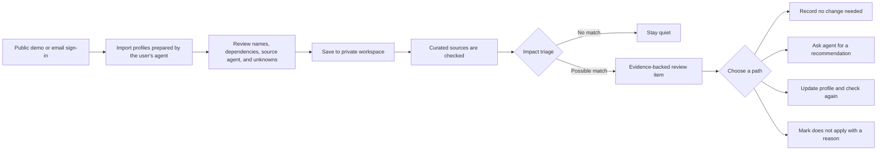
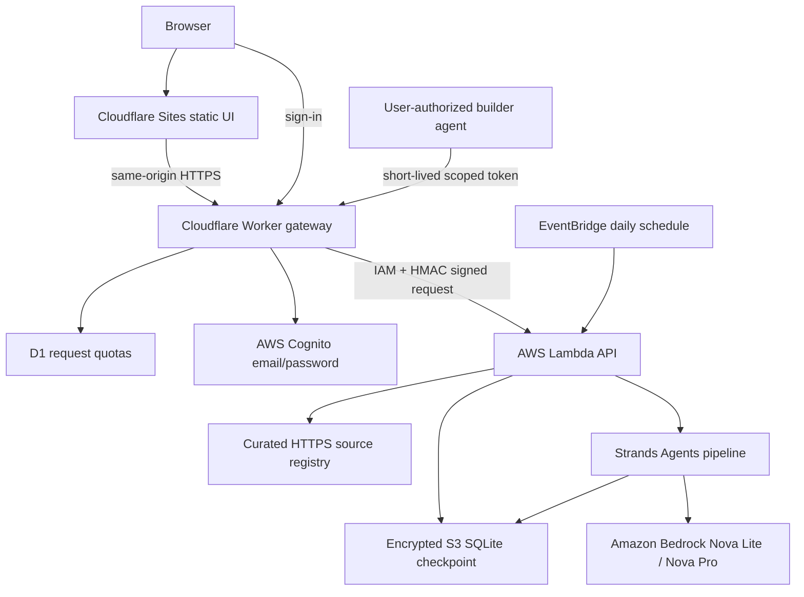

# BuiltWatch — competition architecture and workflow

## One-line product

BuiltWatch watches external changes that could affect the AI agents, automations, APIs,
and small web apps a technical operator already runs. It filters irrelevant changes,
explains why a possible match matters, and gives the person or their builder agent a
clear next review step.

## User journey

The agent is optional after import. A handoff prompt contains the outside change,
source evidence, dates, and the saved app facts. The agent can inspect the real project
and return a recommendation, but BuiltWatch never changes code and the user records the
final outcome. A connected agent is a user-triggered, one-app check-in—not an always-on
conversation or an unrestricted sync.

## Deployed topology

The browser never receives AWS signing credentials. Cognito verifies the email and
password; the gateway creates a seven-day HttpOnly session. D1 stores only rate-limit
counters and quota state. Profiles, findings, dispositions, and cost ledgers remain in
the private AWS workspace partition.

## How an evaluation works

1. A source snapshot is retrieved only from `sources/registry.yaml`.
2. Completed `(system, source change)` pairs are cached by profile and content hashes.
3. Nova Lite screens likely matches cheaply; Nova Pro investigates only survivors.
4. Read-only Strands tools expose stored profile facts and evidence passages.
5. Code validates every citation and fact reference. Unsupported relevance is downgraded
   to `insufficient_information` rather than shown as a confident alert.
6. A material revision creates a new review item. Repeating the same scan stays quiet.
7. A failed source is shown as a coverage failure, never as an all-clear.

## Import, update, and deduplication behavior

Bulk imports accept up to ten profiles and require stable IDs. Re-importing the same ID
updates that saved profile instead of creating a duplicate. A changed profile is stored
as the current version and is evaluated on the next check. Removing an app deletes its
open findings and excludes it from future checks; historical check and cost records stay
available for auditability. Demo imports are local and never invoke a model.

## Agent connection boundary

The optional connection is deliberately narrow:

- one active connection per workspace;
- one selected app profile;
- token shown once and expiring after 90 days;
- the agent can return a profile update or review recommendation;
- the agent cannot discover other apps, close findings, start paid checks, change account
  settings, or deploy code;
- the user still records the outcome in BuiltWatch.

This makes the product useful without claiming that BuiltWatch can wake or continuously
read an arbitrary AI-agent conversation.

## Cost and safety controls

The public demo and all demo imports run locally with saved historical examples. They do
not call a model. Live workspaces enforce registration, request, daily, monthly, and
per-check ceilings. Intake has its own low threshold; unchanged pairs are cached; manual
checks are rate-limited; and the owner can pause paid checks. A cost monitor can fail
closed when billing data is stale or unavailable. AWS infrastructure and Sites hosting
can still incur provider charges, so the product does not promise a zero-dollar bill.

## End-to-end audit evidence

The workflow was exercised in the browser with a disposable `Audit Test App` profile:

| Checkpoint | Result |
|---|---|
| Public demo opens without sign-in | Passed; historical systems and findings are visible |
| Import JSON and open review | Passed; source agent and profile facts are shown |
| Back from review | Fixed; pasted JSON is preserved instead of being lost |
| Confirm save | Passed; app appears in the local demo systems list |
| Reset demo | Passed; test app and local changes are removed |
| Finding → Record outcome | Passed; the finding count decreases and the outcome is recorded |
| Create a private account and verify email | Passed with a disposable Gmail plus-alias |
| Private workspace → add, edit, remove app | Passed; the test app was removed at the end |
| Check history after CRUD test | Passed; no check was started and estimated model use stayed at $0.000 |

Screenshots for the public demo, import review, account creation, saved app, and clean
check-history state were captured during this audit for the competition walkthrough. The
live account workflow used a disposable app; no live check was started as part of UI
validation, and the account was left with zero systems and zero findings.

## Competition framing

BuiltWatch is not another general-purpose dashboard. Its narrow first audience is the
developer, technical maker, consultant, or small team that already runs several agents,
automations, APIs, or small apps and does not have time to repeatedly compare them with
every relevant external change. The differentiator is the judgment-heavy link between
an outside development and the exact saved system detail that makes it matter.
